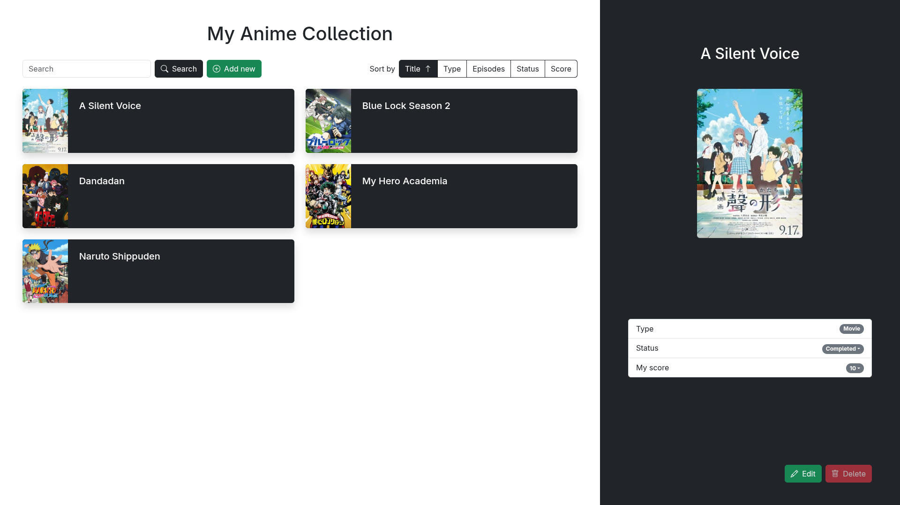

# Anime-Collection
Project made for Advanced Internet Applications laboratories at Poznań University of Technology.

# Description
This project implements a simple frontend anime collection web application using Vite, React, TypeScript, and Bootstrap.

